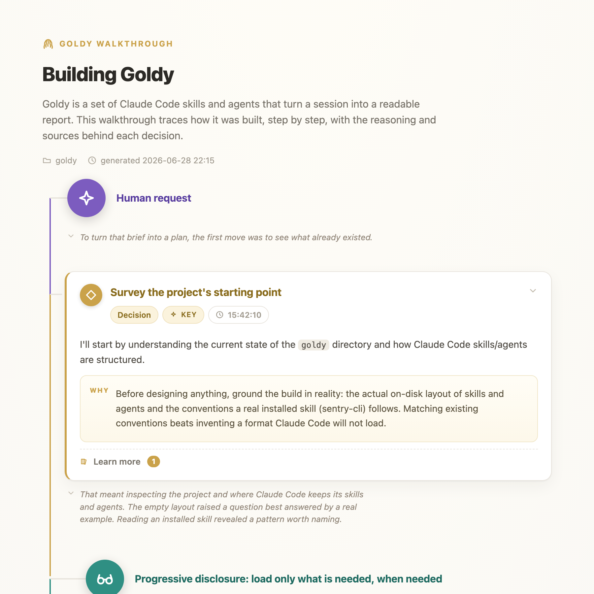
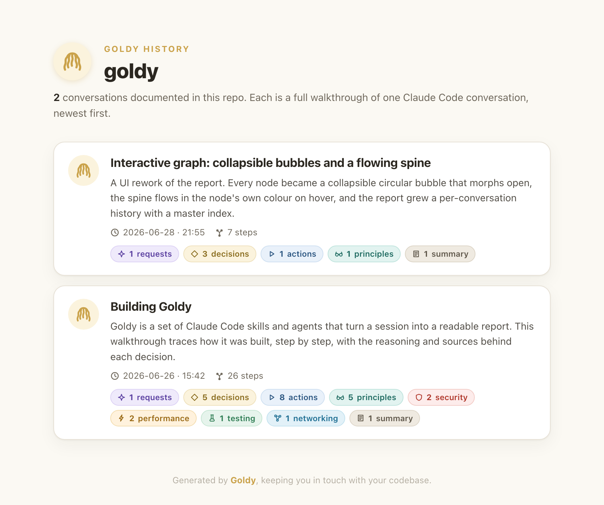

# Goldy

**Stay in touch with what Claude Code does to your codebase.**

Goldy is a set of Claude Code skills and agents that export an entire session,
every thought and every action, into a beautiful, human-readable HTML report.
It is the answer to *"wait, what did the agent actually just do, and why?"*



---

## Contents

- [What you get](#what-you-get)
- [Setup](#setup)
- [First run: the init wizard](#first-run-the-init-wizard)
- [Generating a report](#generating-a-report)
- [The resource library](#the-resource-library)
- [What a report contains](#what-a-report-contains)
- [How it works](#how-it-works)
- [Project layout](#project-layout)
- [Requirements](#requirements)

---

## What you get

Three skills and one research agent:

| Piece | What it does |
|-------|--------------|
| **`goldy`** | The main skill. Turns the current session into a Notion-style HTML report. |
| **`goldy-init`** | A one-time wizard that profiles your repo so reports are tailored. |
| **`goldy-resources`** | Paste a URL; it crawls and indexes the resource so Goldy prefers it. |
| **`goldy-source-types`** | Add a new kind of reference with a custom hand-drawn SVG icon. |
| **`goldy-historian`** | A research subagent that gathers references and summaries in bulk. |

---

## Setup

### 1. Get the repo

```bash
git clone <your-fork-or-this-repo> ~/Dev/GitHub/goldy
cd ~/Dev/GitHub/goldy
```

(Any location works; the install script uses wherever the repo lives.)

### 2. Install

```bash
./install.sh
```

This is idempotent and safe to re-run after pulling updates. It:

- symlinks the three skills into `~/.claude/skills/` and the agent into
  `~/.claude/agents/`,
- makes the scripts executable,
- registers a `SessionStart` hook in `~/.claude/settings.json` that fires the
  init wizard once per new repo (see below).

To install into a non-default config dir, set `CLAUDE_CONFIG_DIR` first.

### 3. Verify

Open any project in Claude Code and type `/goldy`. If the skill is found, you are
set. (You can also run `python3 ~/.claude/skills/goldy/scripts/render.py --help`.)

### Uninstall

Remove the symlinks in `~/.claude/skills/goldy*` and
`~/.claude/agents/goldy-historian.md`, and delete the `SessionStart` entry that
points at `firstrun.sh` from `~/.claude/settings.json`.

---

## First run: the init wizard

The first time you use Claude Code in a repo that has documentation but no Goldy
profile, a `SessionStart` hook nudges Claude to run **goldy-init** once. You can
also start it yourself anytime:

> **goldy-init**, or *"set up Goldy for this repo"*

The wizard:

1. **scans** the project (doc files, manifests, stacks, languages),
2. **reads** `CLAUDE.md`, `AGENTS.md`, `README`, `ARCHITECTURE`, `CONTRIBUTING`,
3. **asks you** a few short questions (audience, focus, depth),
4. **saves** `.goldy/profile.json`.

From then on, every report is tailored: the right stack and references, the right
amount of teaching for your audience, the insight nodes you care about (security,
performance, principles), and your team's conventions.

The nudge stops once a profile exists. To dismiss it without profiling, create an
empty `.goldy/.init-skipped` file.

---

## Generating a report

Inside any Claude Code session, ask:

> **/goldy**, or *"generate a Goldy report of this session"*, or *"explain what
> you just did"*

Goldy runs five explicit phases (it learns before it writes):

1. **Ingest** the full session transcript and the project profile.
2. **Inventory** every language, tool, principle, security and performance angle
   the session touched.
3. **Research** each one: authoritative references, hands-on tutorials, exact
   sections, and short summaries (preferring your resource library and LabEx).
4. **Enrich** the nodes with rationale, alternatives, materials, and teaching
   nodes.
5. **Render** this conversation's report into `.goldy/reports/`, then rebuild the
   master index and offer to open it.

Open the hub with:

```bash
open .goldy/goldy-report.html       # macOS
```

### One repo, many conversations

A repo accumulates many sessions, so Goldy keeps a **history**: each conversation
gets its own report under `.goldy/reports/<id>.html`, and `.goldy/goldy-report.html`
is a **master index** that links to all of them, newest first. Re-rendering the
same session overwrites its report rather than adding a duplicate.



### Run the pipeline by hand

```bash
SK=~/.claude/skills/goldy/scripts
python3 $SK/parse_transcript.py --latest -o .goldy/nodes.json
# ... enrich .goldy/nodes.json (rationale, materials, alternatives, teaching nodes) ...
python3 $SK/render.py .goldy/nodes.json -o .goldy/reports/<id>.html --register
python3 $SK/render_index.py .goldy/reports -o .goldy/goldy-report.html
```

`--register` records the report in `.goldy/reports/index.json`; `render_index.py`
turns that manifest into the hub. To document a past session, pass that session's
`.jsonl` path to `parse_transcript.py` instead of `--latest`.

---

## The resource library

Give Goldy your own trusted learning sources. Paste a URL and ask:

> *"add this resource to Goldy"* / *"index this for learning"* (the
> **goldy-resources** skill)

It crawls the page, distills what it teaches (topics, principles, skills,
languages, key sections), and persists it to `~/.claude/goldy/resources.json`
(shared across projects). When Goldy enriches a report, it prefers these.

Manage the library directly:

```bash
R=~/.claude/skills/goldy-resources/scripts/resources.py
python3 $R list                       # everything
python3 $R search "git rebase"        # find matching resources
python3 $R materials python -n 3      # ready-to-merge report materials
python3 $R path                       # where the library lives
```

**LabEx** (`https://labex.io/learn`) is seeded as the preferred hands-on platform
for Linux, shell, git, docker, devops, cybersecurity, databases, Wireshark and
Python, and shell commands link out to
[explainshell](https://explainshell.com).

---

## What a report contains

A vertical graph of nodes connected by a colored spine. Node kinds:

- **Request** (violet): the human prompt that started the work.
- **Decision** (gold): Claude's reasoning, with a **WHY** block and, where it
  matters, an *Other paths considered* list of alternatives and tradeoffs.
- **Action** (blue): a tool call (Bash, Edit, Write, ...) with its result.
- **Principle / Security / Performance / Testing / Networking** (teal / red /
  amber / green / blue): teaching nodes that name the idea behind a choice and
  link the book, blog, spec or course.
- **Summary** (neutral): a single closing node that recaps the whole walkthrough
  as a short lead plus a few bulleted takeaways.

Every node has a *Learn more* drawer with references tagged by kind (reference,
tutorial, language, spec, book), deep-linked to the exact section, each with an
optional *Read summary*.

### Reading the graph

The graph is interactive, and made to be read top to bottom like a story:

- **Folded bubbles.** Every node starts collapsed to a big, kind-colored icon
  bubble with its title beside it. Click a bubble (or *Expand all*) and it morphs
  open: the icon shrinks to a header badge while the full card grows around it.
- **Live spine.** Hovering a bubble lights its connector and spine segment in the
  bubble's own color, with a brighter band flowing toward the next node.
- **Priority staircase.** Bubbles step right by priority, so the key steps hug the
  spine and minor ones cascade outward and the shape shows the hierarchy at a glance.
- **Story bridges.** A one-line transition sits between each pair of bubbles. When
  you filter nodes out (by **detail level** or **type chip**), the discarded ones'
  sentences are stitched into the gap so the narrative never breaks.

Commands and code teach you directly:

- hover any shell token (command, **subcommand**, flag, path, redirection like
  `2>`, device files like `/dev/null`, operators) for an explanation plus a
  *read more* link to **explainshell**,
- hover meaningful output (paths, permissions, exit codes, errors),
- embedded programs (`python3 -c ...`, heredocs) and written code files (`.py`,
  `.sh`, ...) get their own labeled, syntax-highlighted, hover-annotated panel.

The whole thing is one self-contained HTML file with inline CSS and JS: no build
step, no dependencies, no network needed to view. And no em dashes, ever.

---

## How it works

```
session transcript (JSONL)         ~/.claude/projects/<slug>/<id>.jsonl
        │
        ▼  parse_transcript.py   (deterministic, no LLM)
   nodes.json   ──►  request / decision / action nodes, empty rationale+materials
        │
        ▼  the goldy skill (Claude) + goldy-historian + your profile + library
   nodes.json   ──►  every node gets a WHY, alternatives, and tailored materials
        │
        ▼  render.py             (standalone, no deps)
   goldy-report.html
```

The split is deliberate: **mechanical work stays in Python** (cheap,
deterministic, testable); **judgement stays in the model** (rationale, research,
teaching).

---

## Project layout

| Path | What |
|------|------|
| `skills/goldy/SKILL.md` | the `/goldy` skill, orchestrates the five-phase pipeline |
| `skills/goldy/scripts/parse_transcript.py` | transcript → raw nodes |
| `skills/goldy/scripts/render.py` | nodes → Notion-style HTML (one report per conversation) |
| `skills/goldy/scripts/render_index.py` | the history manifest → master index page |
| `skills/goldy/scripts/history.py` | maintains `.goldy/reports/index.json` |
| `skills/goldy-init/SKILL.md` | first-run wizard that profiles the repo |
| `skills/goldy-init/scripts/profile.py` | repo scanner + per-project profile (`.goldy/profile.json`) |
| `skills/goldy-init/scripts/firstrun.sh` | SessionStart hook that fires the wizard once |
| `skills/goldy-resources/SKILL.md` | crawl a pasted URL and index it |
| `skills/goldy-resources/scripts/resources.py` | persistent resource library (`~/.claude/goldy/resources.json`) |
| `skills/goldy-source-types/SKILL.md` | add a new reference kind with a custom SVG icon |
| `skills/goldy-source-types/scripts/source_types.py` | the source-type + icon registry (`~/.claude/goldy/*.json`) |
| `skills/goldy/scripts/icons.py` | the built-in SVG icon set (no emoji) |
| `agents/goldy-historian.md` | research subagent for bulk material gathering |
| `install.sh` | symlinks the skills + agent and registers the hook |
| `.goldy/` | Goldy run on its own build (a live demo: open `goldy-report.html`) |
| `.goldy/build.sh` | rebuilds the demo: a report per session + the master index |

### Where Goldy keeps state

| Location | Scope | Holds |
|----------|-------|-------|
| `.goldy/profile.json` | per project | the repo profile from `goldy-init` |
| `.goldy/goldy-report.html` | per project | the master index linking every report |
| `.goldy/reports/<id>.html` | per conversation | one report per Claude Code session |
| `.goldy/reports/index.json` | per project | the history manifest the index is built from |
| `~/.claude/goldy/resources.json` | global | your indexed learning resources |

---

## Requirements

- **Claude Code** with skills enabled.
- **Python 3** (ships with macOS). No third-party packages.
- A web browser to view the report. The file itself needs no network.

---

*Built with Claude Code. The report in `.goldy/` is Goldy run on its own build
session: open it to see exactly how this repo came to be.*
